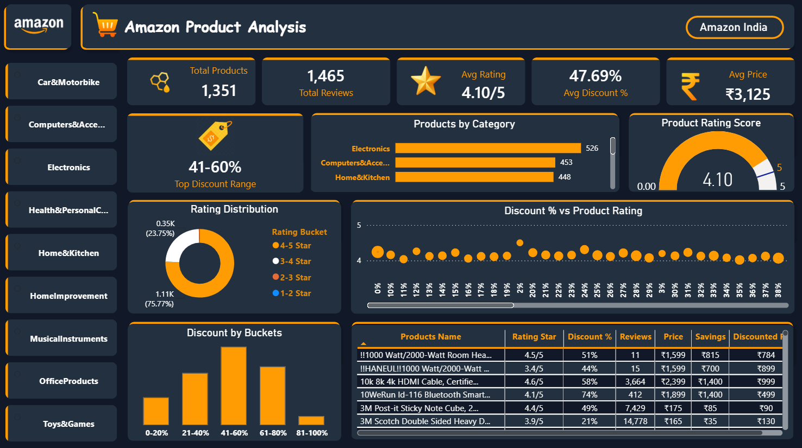

# 🛒 Amazon Product Analysis Dashboard

> Interactive Power BI Dashboard analyzing 
> Amazon India Products — Discounts, 
> Ratings, Categories & Savings
## 🎯 Dashboard Overview

| KPI | Value |
|-----|-------|
| 📦 Total Products | 1,351 |
| ⭐ Total Reviews | 1,465 |
| 🌟 Avg Rating | 4.10/5 |
| 🏷️ Avg Discount % | 47.69% |
| 💰 Avg Price | ₹3,125 |
| 🔥 Top Discount Range | 41-60% |

## 📊 Visuals Included

| Visual | Description |
|--------|-------------|
| 🃏 KPI Cards | Total Products, Reviews, Rating, Discount, Price |
| 📊 Bar Chart | Products by Category |
| 🍩 Donut Chart | Rating Distribution |
| 📊 Column Chart | Discount by Buckets |
| 🎯 Scatter Plot | Discount % vs Product Rating |
| 🔵 Gauge Chart | Product Rating Score |
| 📋 Table | Product Details |
| 🏷️ Card | Top Discount Range |
| 🎛️ Slicer | Category Filter |

## 🔑 Key Insights

---

## 📁 Products by Category

| Category | Products |
|----------|---------|
| Electronics | 526 🏆 |
| Computers & Accessories | 453 |
| Home & Kitchen | 448 |
| Health & Personal Care | - |
| Car & Motorbike | - |
| Office Products | - |
| Musical Instruments | - |
| Home Improvement | - |
| Toys & Games | - |

---

## ⭐ Rating Distribution

| Rating | Count | % |
|--------|-------|---|
| 4-5 Star | 1,110 | 75.77% 🏆 |
| 3-4 Star | 350 | 23.75% |
| 2-3 Star | - | - |
| 1-2 Star | - | - |

---

## 🏷️ Discount Buckets

| Bucket | Products |
|--------|---------|
| 0-20% | Low |
| 21-40% | Medium |
| 41-60% | Highest 🏆 |
| 61-80% | High |
| 81-100% | Lowest |

---

## 📋 Top Products Sample

| Product | Rating | Discount | Reviews | Price |
|---------|--------|----------|---------|-------|
| 10k 8k HDMI Cable | 4.6/5 | 58% | 3,664 | ₹999 |
| 3M Post-it Note | 4.4/5 | 49% | 7,429 | ₹90 |
| 3M Scotch Tape | 3.9/5 | 21% | 14,778 | ₹130 |
| Bluetooth Smart | 4.1/5 | 74% | 412 | ₹499 |

## 🎥 Dashboard Demo



## 🛠️ Tools Used


## 🎓 Learning Source
Learned from **Satish Dhawale Sir**
Founder of **SkillCourse**

## 📫 Contact

[](https://www.linkedin.com/in/aditya-kumar-sharma-137503316/?trk=li_LOL_DA_global_careers_jobsgtm_otwGeneral_res_Sep2023_dav1)
[](mailto:adityajjkl773975@gmail.com)
[](https://github.com/adityasharma2468)

## 💡 DAX Measures Used

```dax
Total Products = DISTINCTCOUNT(amazon[product_id])
Avg Rating = AVERAGE(amazon[rating])
Avg Discount = AVERAGE(amazon[discount_percentage]) * 100
Top Discount Range = FIRSTNONBLANK(TOPN(1,
    VALUES(amazon[Discount Bucket]),
    CALCULATE(COUNTROWS(amazon)), DESC), 1)


